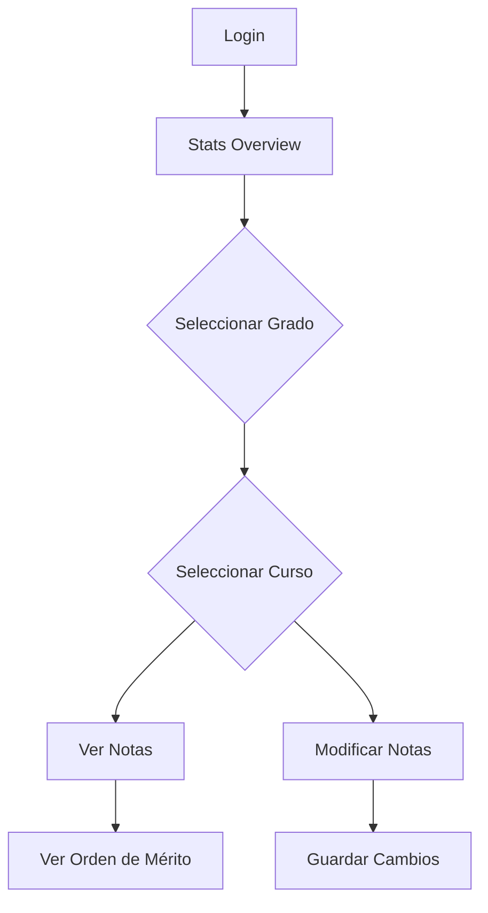
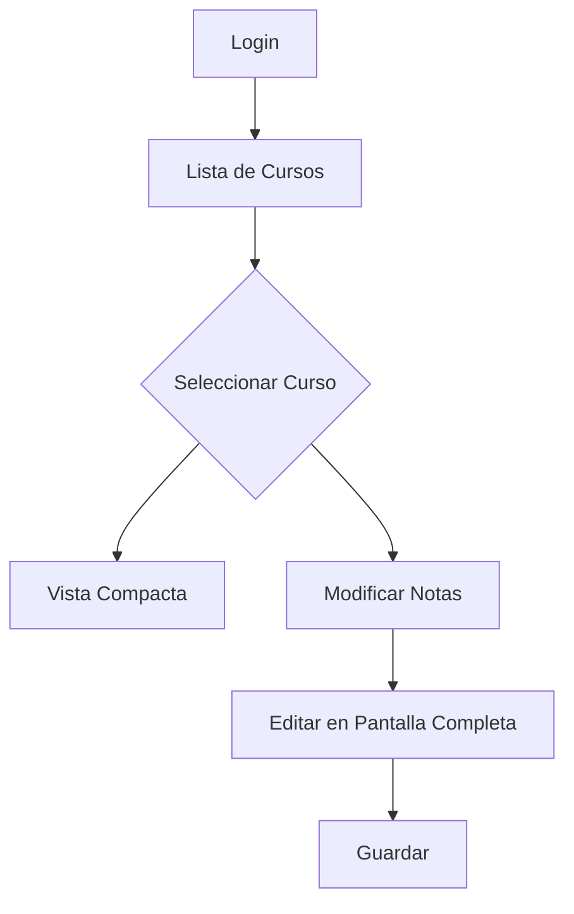
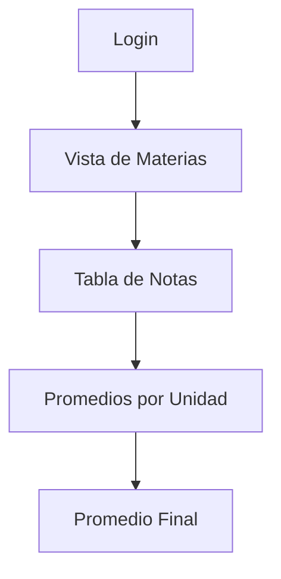

# 📘 Documentación Técnica - Sistema de Gestión Escolar

## 🏗️ Arquitectura del Proyecto

### Stack Tecnológico

```
Frontend Framework: React 18 + TypeScript
Build Tool: Vite 5
Styling: Tailwind CSS 4
UI Components: Shadcn/ui + Radix UI
Icons: Lucide React
State Management: React Hooks (useState, useEffect)
Data Persistence: LocalStorage
Deployment: GitHub Pages
```

### Estructura de Carpetas

```
/
├── .github/
│   └── workflows/
│       └── deploy.yml          # GitHub Actions workflow
├── components/
│   ├── AdminDashboard.tsx      # Dashboard administrativo
│   ├── TeacherDashboard.tsx    # Dashboard docente
│   ├── StudentDashboard.tsx    # Dashboard estudiante
│   ├── SupportDashboard.tsx    # Dashboard soporte técnico
│   ├── AuthForm.tsx            # Formulario de autenticación
│   ├── figma/
│   │   └── ImageWithFallback.tsx
│   └── ui/                     # Componentes UI reutilizables
│       ├── button.tsx
│       ├── card.tsx
│       ├── table.tsx
│       └── ...
├── imports/
│   └── Login1.tsx              # Componente importado de Figma
├── styles/
│   └── globals.css             # Estilos globales + Tailwind
├── utils/
│   ├── mockDatabase.ts         # Base de datos simulada
│   └── supabase/
├── public/
│   └── favicon.svg             # Favicon del sitio
├── App.tsx                     # Componente raíz
├── main.tsx                    # Punto de entrada
├── index.html                  # HTML principal
├── vite.config.ts              # Configuración de Vite
├── tsconfig.json               # Configuración de TypeScript
├── tailwind.config.js          # Configuración de Tailwind
└── package.json                # Dependencias y scripts
```

## 🔐 Sistema de Autenticación

### Roles de Usuario

| Rol | Descripción | Permisos |
|-----|-------------|----------|
| **Admin** | Administrador | Acceso total, gestión de notas |
| **Teacher** | Docente | Gestión de notas de sus cursos |
| **Student** | Estudiante | Visualización de sus notas |
| **Support** | Soporte Técnico | Gestión de usuarios |

### Flujo de Autenticación

```typescript
// 1. Usuario ingresa credenciales
// 2. AuthForm valida contra mockDatabase
// 3. Se genera un token JWT simulado (base64)
// 4. Token y user data se guardan en localStorage
// 5. App.tsx verifica la sesión al cargar
// 6. Se renderiza el dashboard correspondiente
```

### Token Structure

```typescript
{
  userId: string,
  email: string,
  role: 'admin' | 'teacher' | 'student' | 'support',
  timestamp: number // Para expiración (24h)
}
```

## 📊 Base de Datos Mock

### Estructura de Datos

#### Students
```typescript
interface Student {
  id: string;
  fullName: string;      // Formato: "Apellidos, Nombres"
  email: string;
  gradeId: string;       // Referencia a Grade
  section: 'A' | 'B';
}
```

#### Teachers
```typescript
interface Teacher {
  id: string;
  fullName: string;
  email: string;
  subjects: string[];
}
```

#### Grades (Grados)
```typescript
interface Grade {
  id: string;
  name: string;          // "1° Secundaria", etc.
  level: number;         // 1-5
}
```

#### Courses (Materias)
```typescript
interface Course {
  id: string;
  name: string;
  gradeId: string;
  teacherId: string;
}
```

#### StudentGrades (Calificaciones)
```typescript
interface StudentGrade {
  id: string;
  studentId: string;
  courseId: string;
  unidad1: GradeComponent | null;
  unidad2: GradeComponent | null;
  unidad3: GradeComponent | null;
  unidad4: GradeComponent | null;
}

interface GradeComponent {
  tareas: number;        // 0-20, peso 30%
  conceptual: number;    // 0-20, peso 30%
  examenes: number;      // 0-20, peso 40%
}
```

### Cálculo de Notas

```typescript
// Nota de unidad
notaUnidad = (tareas * 0.3) + (conceptual * 0.3) + (examenes * 0.4)

// Promedio final
promedioFinal = (unidad1 + unidad2 + unidad3 + unidad4) / 4

// Solo se muestra si las 4 unidades tienen notas
```

## 🎨 Sistema de Diseño

### Paleta de Colores

```css
/* Colores Principales */
--primary: #8c030e;           /* Rojo Granate */
--secondary: #fef3f3;         /* Rojo Claro */
--accent: #f5ba3c;            /* Dorado */
--chart-2: #0433bf;           /* Azul */

/* Estados */
--destructive: #8c030e;       /* Rojo para errores */
--success: #22c55e;           /* Verde para aprobados */
--warning: #eab308;           /* Amarillo para alertas */
```

### Tipografía

```css
/* Sistema de fuentes nativo */
font-family: system-ui, -apple-system, sans-serif;

/* Pesos */
--font-weight-normal: 400;
--font-weight-medium: 500;
```

### Componentes Clave

#### Button
- Variantes: default, outline, ghost, destructive
- Tamaños: sm, default, lg, icon

#### Card
- Estructura: CardHeader, CardTitle, CardDescription, CardContent

#### Table
- Headers con colores por sección
- Responsive design
- Sticky headers en scroll

#### Badge
- Indicadores de calificaciones con colores
- Verde (≥11), Rojo (<11)

## 🔄 Flujos de Usuario

### Admin Dashboard



### Teacher Dashboard



### Student Dashboard



## ⚡ Optimizaciones de Performance

### Build Optimization

```typescript
// vite.config.ts
build: {
  minify: 'terser',
  terserOptions: {
    compress: {
      drop_console: true,    // Remover console.log
      drop_debugger: true
    }
  },
  rollupOptions: {
    output: {
      manualChunks: {
        'vendor-react': ['react', 'react-dom'],
        'vendor-ui': ['lucide-react'],
      }
    }
  }
}
```

### Code Splitting

- React y React-DOM en chunk separado
- UI components en chunk vendor
- Lazy loading de dashboards (futuro)

### Asset Optimization

- Imágenes de Figma optimizadas
- SVGs inline cuando sea posible
- CSS purging automático con Tailwind

## 🧪 Testing (Futuro)

### Estructura Recomendada

```
/tests/
  ├── unit/
  │   ├── utils/
  │   │   └── mockDatabase.test.ts
  │   └── components/
  │       └── AuthForm.test.tsx
  ├── integration/
  │   └── dashboards/
  │       └── AdminDashboard.test.tsx
  └── e2e/
      └── login-flow.spec.ts
```

### Herramientas Sugeridas

- **Unit Tests:** Vitest + React Testing Library
- **E2E Tests:** Playwright o Cypress
- **Coverage:** c8 o istanbul

## 🔒 Seguridad

### Medidas Actuales

✅ **Validación de Inputs**
- Notas entre 0-20
- Formato de email validado
- Sanitización de inputs

✅ **Sesión Segura**
- Token con expiración (24h)
- Logout limpia localStorage
- Verificación de token al cargar

### Mejoras Futuras

🔄 **Backend Real**
- Autenticación con JWT real
- Hash de contraseñas (bcrypt)
- Rate limiting
- CORS configurado

🔄 **Validación Avanzada**
- Zod para schemas
- Sanitización XSS
- CSRF tokens

## 📱 Responsive Design

### Breakpoints

```css
sm: 640px   /* Mobile landscape */
md: 768px   /* Tablet */
lg: 1024px  /* Desktop */
xl: 1280px  /* Large desktop */
2xl: 1536px /* Extra large */
```

### Mobile-First Approach

- Sidebar colapsable en móvil
- Tablas con scroll horizontal
- Touch-friendly buttons (min 44x44px)
- Navegación hamburguesa

## 🚀 Deployment

### GitHub Actions Workflow

```yaml
1. Trigger: Push a main
2. Install: npm ci
3. Build: npm run build
4. Deploy: Upload to GitHub Pages
5. Live: ~2-3 minutos
```

### Variables de Entorno

```bash
# .env.production
VITE_APP_NAME="Sistema de Gestión Escolar"
VITE_VERSION="1.0.0"
```

## 📈 Métricas de Performance

### Lighthouse Targets

- **Performance:** >90
- **Accessibility:** >95
- **Best Practices:** >95
- **SEO:** >90

### Bundle Size

```
vendor-react.js:    ~140KB (gzipped: ~45KB)
vendor-ui.js:       ~80KB  (gzipped: ~25KB)
main.js:            ~200KB (gzipped: ~60KB)
styles.css:         ~50KB  (gzipped: ~10KB)
```

## 🔧 Troubleshooting

### Problemas Comunes

#### 1. Build Error: "Module not found"

**Causa:** Importación incorrecta
**Solución:**
```typescript
// ❌ Incorrecto
import { Button } from 'components/ui/button';

// ✅ Correcto
import { Button } from './components/ui/button';
```

#### 2. Notas no se guardan

**Causa:** LocalStorage no disponible
**Solución:** Verificar permisos del navegador

#### 3. Assets no cargan en GitHub Pages

**Causa:** Base path incorrecto
**Solución:**
```typescript
// vite.config.ts
base: './' // Rutas relativas
```

## 📚 Referencias

- [React Documentation](https://react.dev)
- [Vite Guide](https://vitejs.dev/guide/)
- [Tailwind CSS](https://tailwindcss.com/docs)
- [Shadcn/ui](https://ui.shadcn.com)
- [GitHub Pages](https://pages.github.com)

## 🎯 Roadmap Futuro

### v2.0 - Backend Integration
- [ ] API REST con Node.js + Express
- [ ] Base de datos PostgreSQL
- [ ] Autenticación JWT real
- [ ] Upload de documentos

### v2.1 - Features Avanzados
- [ ] Exportar a Excel
- [ ] Gráficos de rendimiento
- [ ] Notificaciones push
- [ ] Chat docente-estudiante

### v2.2 - Mobile App
- [ ] React Native app
- [ ] Offline mode
- [ ] Biometric login

---

**Última actualización:** Noviembre 2024  
**Versión:** 1.0.0  
**Licencia:** MIT
